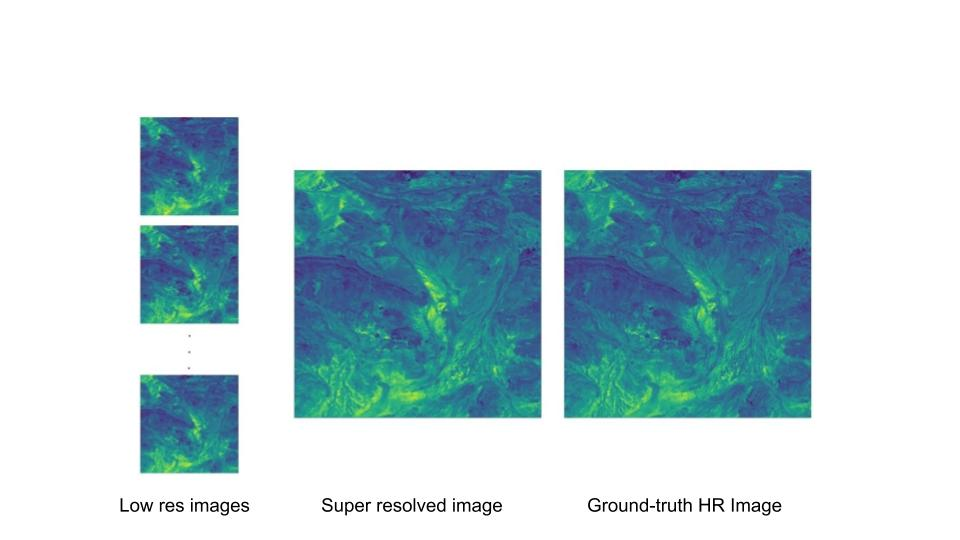

# Multi-Image Super-Resolution for Remote Sensing using Deep RecurrentNetworks

Pytorch implementation of MISR-GRU, a deep neural network for multi image super-resolution (MISR), for ProbaV Super Resolution Competition [European Space Agency's Kelvin competition](https://kelvins.esa.int/proba-v-super-resolution/home/).


## MISR-GRU Architecture

### *** Trained model is coming soon for download !!!


## Example of Super Resolution



## A recipe to enhance the vision of the ESA satellite Proba-V


#### 0. Setup python environment
- Setup a python environment and install dependencies, we need python version >= 3.6.8

```
pip install -r requirements.txt
```

#### 1. Download data and save clearance

- Download the data from the [Kelvin Competition](https://kelvins.esa.int/proba-v-super-resolution/data/) and unzip it

- Run the save_clearance script to pre-compute clearance scores for low-res views 

```
python save_clearance.py --data_dir /path/to/ESA_data
```  

#### 2. Train model

- Train a model with default config

```
python train.py --config_file_path ../config.json
```

#### 3. Test model - Create Submission file

- Train a model with default config

```
python create_submission_file.py --config_file_path ../config.json
```

#### 3. Submit result and check performance

Although comepetetion is over but model performance [PROBA-V Super Resolution post mortem](https://kelvins.esa.int/proba-v-super-resolution-post-mortem/)